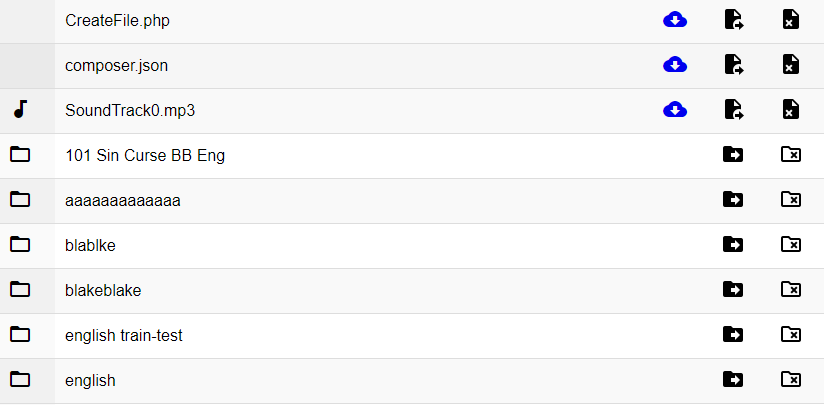

# ROCC Template Manager
### the Goal
The template manager is essentially a file system browser. It displays the template folders and files to ROCC admins and allows them to upload, edit, delete templates. 
### Basics
To navigate to the template manager append "/template_manager.php" to url of the main ROCC homepage. In order to use the template manager the user must be logged in on an admin account.
The first thing the user will likely see upon loading up the page is something like:

This is a list of files and folders. The icons on the left side denote whether an item is a folder or file and if its a file it will a different icon for audio, video, text, and image files. If you double click on a folder row the contents of that folder will then be displayed. Double clicking a file does nothing. The icons on the left are for renaming/moving and deleting files and folders. 

### File Operations
There are three operations that can be performed on individual files. Each operation has a corresponding icon. 

This is the download icon. Clicking it will download that file immediately. 

This is the move/rename icon. The functionality of this icon is probably one of the least intuitive feature of the template manager. Upon clicking a popup will display asking you to rename the file. However the displayed name of the file is not just the name of the file, but the full path name. So a file of the English/Greedy Dog/ folder called Sound1.mp3 will display its current name as English/Greedy Dog/Sound1.mp3, if the user changes its name to French/Greedy Dog/Sound1.mp3 the Sound1.mp3 file will be moved to the French/Greedy folder. If its name is changed to English/Greedy Dog/Sound2.mp3 then will remain in the Greedy Dog/ folder. 

This is the delete file icon. Once clicked a popup will ask you to confirm if you want to delete that file.

### Folder Operations

This is the delete folder icon. As with the delete file icon, upon clicking a popup will ask you to confirm if you want to delete the folder, if so the folder and all of its contents will be deleted. There is no undo functionality, so if you delete it, its gone.

This is the move folder icon. It operates in a way that is very similar to the move file icon, except instead when moving all its contents will be moved also. 

### Other Operations
Towards the top of the page there are four buttons which are always visible.

To the furtherest left is this, the parent folder button. Clicking this button will display the folder one level above the current folder, or the parent folder. 

Moving from left to right, next appears this, the upload file icon. Clicking this button will allow the user to see a popup which has two buttons: a "Choose Files" button which will display a filepicker that can select multiple files. The second button will begin the upload of the selected file(s). 

Next is the upload zip archive button. This will display a similar popup box as the upload file icon, however the filepicker will only allow .zip files to be select. Upon uploading these .zip archives will be unpacked into their original structure. Multiple zips may be uploaded at once.

Finally, this icon allows the user to create a new subfolder of the current folder.

### Creating zip archives on Windows 10
To convert a template to a zip archive to upload to template manager via zip upload feature do the following. 
1. Select the folder and right click to display the options menu
2. Select "Send To" > "Compressed (Zipped) Folder"
3. The suggested name of the archive will be the same as the folder name. 
The name of the zip doesn't matter to the template manager, however a zip cannot have a certain character in its name.

### Note on Performance
When doing large operations, such as uploading multiple templates, renaming or deleting large folders there may be a significant pause, between clicking (starting the operation) and the visible result (finishing the operation). For renaming or deleting large folders this is because to when an operation is performed on a folder, that operation must be performed on each of its contents. So if you rename a template folder with 50 files in it, it should complete within a couple seconds. However if you rename the English/ folder which has 50 templates inside it, each with 50 files, the template manager must rename 2500 files, which will result in a long pause. 

In the case of uploads, when uploading zip files to the template manager there are two main steps. The first is the uploading, where the files are uploaded to the ROCC from the user's machine. The time that takes will vary based on the upload speed of the user's internet connection and the upload size. Second the ROCC must process these zip file (unpack, etc). Thus if the user is uploading 200 - 300 MB worth of templates this process will probably take several minutes. And uploading more than 300 MB at once is not recommended.

